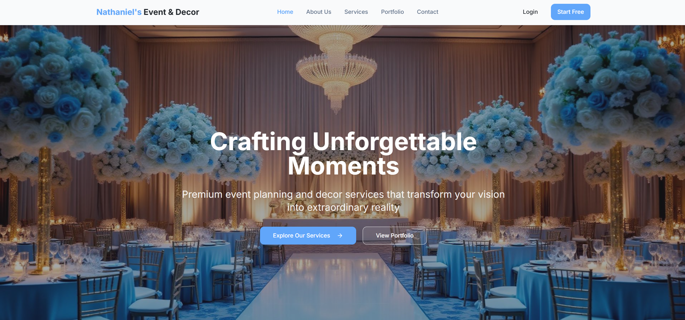
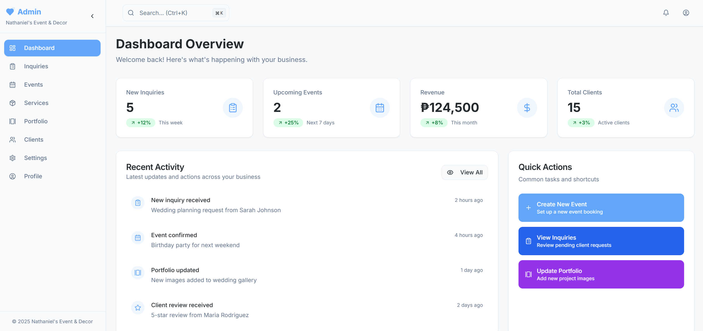

<div align="center">
  
  
  
  
</div>

# Nathaniel's Event & Decor

## 📋 Table of Contents
- [🎉 What is Nathaniel's Event & Decor?](#-what-is-nathaniels-event--decor)
- [🌐 Live Demo](#-live-demo)
- [✨ Features](#-features)
- [🛠️ Tech Stack](#️-tech-stack)
- [🚀 Getting Started](#-getting-started)
- [📁 Project Structure](#-project-structure)
- [📋 Available Scripts](#-available-scripts)
- [👥 Client Interface](#-client-interface)
- [⚙️ Admin Dashboard](#️-admin-dashboard)
- [🎨 Design System](#-design-system)
- [⚡ Performance & Optimization](#-performance--optimization)
- [📊 Demo Data](#-demo-data)
- [🤝 Contributing](#-contributing)
- [📄 License](#-license)
- [👨‍💻 Author](#-author)

---

## 🎉 What is Nathaniel's Event & Decor?

Nathaniel's Event & Decor is a modern, responsive web application showcasing premium event planning and decor services. It features both client-facing and admin management interfaces, demonstrating advanced React development skills with TypeScript, modern UI/UX design, and comprehensive business management capabilities. This project showcases a complete dual-interface system for event planning businesses.

> **Premium Event Planning & Decor Services** - A professional showcase with comprehensive client and admin functionality.

**Live Demo:** [https://nathaniels-event-decor.vercel.app/](https://nathaniels-event-decor.vercel.app/)
**Repository:** [https://github.com/cjjutba/nathaniels-event-decor](https://github.com/cjjutba/nathaniels-event-decor)

<div align="center">
  <a href="https://nathaniels-event-decor.vercel.app/" target="_blank">
    
  </a>
</div>

## 🌐 Live Demo
**Website**: [https://nathaniels-event-decor.vercel.app/](https://nathaniels-event-decor.vercel.app/)

---

## ✨ Features

### Client-Side Experience
- **Event Services Showcase**: Comprehensive display of wedding, birthday, corporate, and specialty event services
- **Interactive Portfolio**: Dynamic gallery showcasing completed events with filtering and search capabilities
- **Service Details**: Detailed service pages with pricing, features, and booking information
- **Contact System**: Professional contact forms with inquiry management
- **Responsive Design**: Fully optimized for desktop, tablet, and mobile devices
- **Modern UI/UX**: Clean, professional interface with smooth animations and transitions

### Admin Dashboard
- **Service Management**: Create, edit, and manage event services with pricing and features
- **Portfolio Administration**: Upload and organize event photos with categorization
- **Client Management**: Track client information, preferences, and event history
- **Event Planning**: Manage upcoming events, schedules, and coordination details
- **Inquiry Handling**: Process and respond to client inquiries and booking requests
- **Analytics Dashboard**: View business metrics, popular services, and client statistics

<div align="center">
  <a href="https://nathaniels-event-decor.vercel.app/admin/dashboard" target="_blank">
    
  </a>
</div>

---

## 🛠️ Tech Stack

### Frontend & Build Tools
- **React 18.3.1** - Modern React with hooks and concurrent features
- **TypeScript 5.5.3** - Full type safety and enhanced developer experience
- **Vite 5.4.1** - Lightning-fast build tool and development server
- **Tailwind CSS 3.4.11** - Utility-first CSS framework for rapid styling
- **shadcn/ui** - High-quality, accessible component library

### State Management & Routing
- **TanStack Query 5.56.2** - Powerful data synchronization and caching
- **React Router DOM 6.26.2** - Declarative routing for React applications
- **React Hook Form 7.53.0** - Performant forms with easy validation
- **Local Storage** - Client-side data persistence for demo purposes

### UI Components & Styling
- **Radix UI** - Unstyled, accessible component primitives
- **Lucide React** - Beautiful and consistent icon library
- **Tailwind Animate** - Smooth animations and transitions
- **Custom Design System** - Professional blue and white color scheme

---

## 🚀 Getting Started

### Prerequisites
- **Node.js 18+** (recommended) or **Bun** (latest version)
- **npm**, **yarn**, or **pnpm** package manager

### Installation
1. **Clone the repository**
   ```bash
   git clone https://github.com/cjjutba/nathaniels-event-decor.git
   cd nathaniels-event-decor
   ```

2. **Install dependencies**
   ```bash
   npm install
   # or
   yarn install
   # or
   pnpm install
   ```

3. **Start development server**
   ```bash
   npm run dev
   # or
   yarn dev
   # or
   pnpm dev
   ```

4. **Open your browser**
   Navigate to [http://localhost:8080](http://localhost:8080) to view the application

### Admin Access
- **Username**: `admin`
- **Password**: `admin123`
- **Admin Dashboard**: Navigate to `/admin` and use the credentials above

---

## 📁 Project Structure
```
src/
├── components/          # Reusable UI components
│   ├── ui/             # shadcn/ui base components
│   ├── client/         # Client-facing components
│   ├── admin/          # Admin dashboard components
│   └── common/         # Shared components
├── pages/              # Route components
│   ├── client/         # Client-side pages
│   └── admin/          # Admin dashboard pages
├── hooks/              # Custom React hooks
├── contexts/           # React contexts for state management
├── lib/                # Utilities and configuration
├── assets/             # Static assets (images, icons)
├── layouts/            # Layout components
└── types/              # TypeScript type definitions
```

---

## 📋 Available Scripts

| Command | Description |
|---------|-------------|
| `npm run dev` | Start development server on port 8080 |
| `npm run build` | Build for production |
| `npm run preview` | Preview production build |
| `npm run lint` | Run ESLint for code quality |

---

## 👥 Client Interface
The client-facing interface provides a professional showcase of event planning services:

### Home Page
- Hero section with compelling call-to-action
- Featured services with images and pricing
- Client testimonials and success stories
- Recent portfolio highlights

### Services Page
- Comprehensive service listings with detailed descriptions
- Interactive filtering by event type
- Pricing information and feature comparisons
- Direct inquiry and booking capabilities

### Portfolio Page
- Dynamic gallery with category filtering
- High-quality event photography
- Project details and client information
- Search functionality for specific events

### Contact Page
- Professional contact forms
- Business information and location
- Service inquiry system
- Direct communication channels

---

## ⚙️ Admin Dashboard
The admin interface provides comprehensive management capabilities:

### Dashboard Overview
- Business analytics and key metrics
- Recent activity and notifications
- Quick access to common tasks
- Performance indicators

### Service Management
- Create and edit service offerings
- Manage pricing and package details
- Upload service images and descriptions
- Track service popularity and bookings

### Portfolio Management
- Upload and organize event photos
- Categorize projects by event type
- Manage project descriptions and details
- Feature highlight projects

### Client Management
- Track client information and preferences
- Manage client communication history
- Monitor project timelines and deliverables
- Generate client reports

### Event Planning
- Schedule and coordinate upcoming events
- Manage vendor relationships
- Track project progress and milestones
- Handle logistics and timeline management

---

## 🎨 Design System

### Color Palette
- **Primary Blue**: #3B82F6 - Professional and trustworthy
- **Background**: Cloud white (#F8FAFC) - Clean and modern
- **Text**: Soft black (#1E293B) - Excellent readability
- **Accent**: Gold highlights for premium feel

### Typography
- **Font Family**: Inter - Modern, professional, and highly readable
- **Responsive Scaling**: Optimized for all device sizes
- **Hierarchy**: Clear heading and body text distinctions

### Components
- **Cards**: Consistent shadow and border radius
- **Buttons**: Professional styling with hover states
- **Forms**: Clean, accessible input designs
- **Navigation**: Intuitive and responsive menu systems

---

## ⚡ Performance & Optimization

### Frontend Optimizations
- **Code Splitting**: Route-based lazy loading for optimal bundle sizes
- **Image Optimization**: Responsive images with proper sizing
- **Caching Strategy**: Efficient data caching with TanStack Query
- **Bundle Analysis**: Optimized dependencies and tree shaking

### User Experience
- **Loading States**: Smooth loading indicators and skeleton screens
- **Error Handling**: Graceful error boundaries and user feedback
- **Accessibility**: WCAG compliant with proper ARIA labels
- **Mobile First**: Responsive design optimized for all devices

---

## 📊 Demo Data
This application uses local storage for demo purposes, simulating a full-stack application:
- **Services**: Pre-populated with wedding, birthday, and corporate event services
- **Portfolio**: Sample event photos and project details
- **Clients**: Demo client information and testimonials
- **Analytics**: Simulated business metrics and statistics

---

## 🤝 Contributing
1. Fork the repository
2. Create a feature branch: `git checkout -b feature/amazing-feature`
3. Commit changes: `git commit -m 'Add amazing feature'`
4. Push to branch: `git push origin feature/amazing-feature`
5. Open a Pull Request

---

## 📄 License
This project is licensed under the MIT License - see the [LICENSE](LICENSE) file for details.

---

## 👨‍💻 Author

**CJ Jutba**
- 🌐 **Portfolio**: [https://cjjutba.com/](https://cjjutba.com/)
- 💼 **LinkedIn**: [https://www.linkedin.com/in/cjjutba/](https://www.linkedin.com/in/cjjutba/)
- 🐙 **GitHub**: [https://github.com/cjjutba](https://github.com/cjjutba)
- 📧 **Email**: [hello@cjjutba.com](mailto:hello@cjjutba.com)

### About This Project
Nathaniel's Event & Decor is a **portfolio project** demonstrating modern React development skills, including advanced TypeScript usage, professional UI/UX design, responsive design, state management, and component architecture best practices.

---

<div align="center">
  <h3>If you found this project helpful, please give it a star!</h3>
  
  [](https://github.com/cjjutba/nathaniels-event-decor/stargazers)
  [](https://github.com/cjjutba/nathaniels-event-decor/network/members)
  
  **Built with ❤️ by CJ Jutba**
</div>
